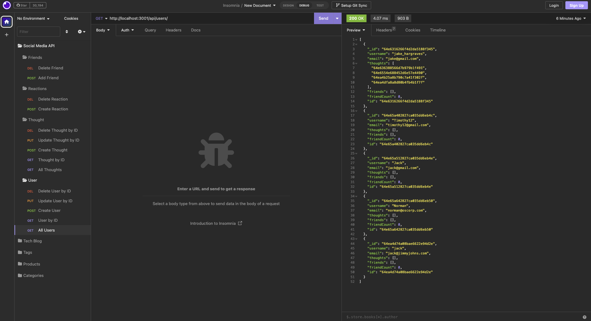

# Social Media API using NoSQL

## Description

This is a social media API that uses a NoSQL database. It allows users to create a user, add friends, create thoughts, and add reactions to thoughts. It also allows users to update and delete their own thoughts and reactions. It also allows users to add and remove friends.
The API uses Express.js for routing, MongoDB for the database, and Mongoose as the ODM.

## Installation

To install this project, clone the repository and run `npm install` to install the dependencies. Then, run `node index.js` to start the server.

## Usage

To use this project, you can use Insomnia Core to test the routes. The routes are as follows:
Users:
- GET all users: /api/users
- GET a single user by ID: /api/users/:id
- POST a new user: /api/users
- PUT to update a user by ID: /api/users/:id
- DELETE a user by ID: /api/users/:id
Friends:
- POST to add a friend to a user: /api/users/:userId/friends/:friendId
- DELETE to remove a friend from a user: /api/users/:userId/friends/:friendId
Thoughts:
- GET all thoughts: /api/thoughts
- GET a single thought by ID: /api/thoughts/:id
- POST a new thought: /api/thoughts
- PUT to update a thought by ID: /api/thoughts/:id
- DELETE a thought by ID: /api/thoughts/:id
Reactions:
- POST a new reaction to a thought: /api/thoughts/:thoughtId/reactions
- DELETE a reaction from a thought: /api/thoughts/:thoughtId/reactions/:reactionId

Screenshot of Insomnia Core:

Video Walkthrough:
https://drive.google.com/file/d/1ZeZ8tK4VJmIwCvlRIVz2BxyzPwk-b6hU/view

## Credits

Node Packages:
- Express.js
- Mongoose

Database:
- MongoDB

## License

MIT License